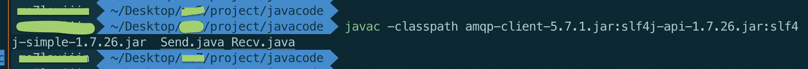
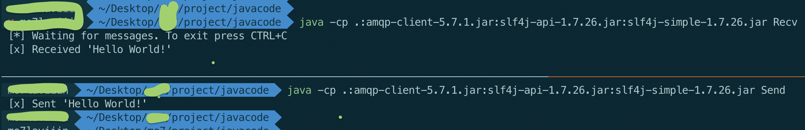
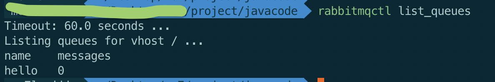

# HelloWorld

> The simplest thing that does something

RabbitMQ基本模型：

+ 生产者：发送消息
+ 队列：位于RabbitMQ内部，是存储消息的缓冲区
+ 消费者：接受消息的处理程序


## Send.java:

```
import com.rabbitmq.client.Channel;
import com.rabbitmq.client.Connection;
import com.rabbitmq.client.ConnectionFactory;

import java.nio.charset.StandardCharsets;

public class Send {

    private final static String QUEUE_NAME = "hello";

    public static void main(String[] argv) throws Exception {
        ConnectionFactory factory = new ConnectionFactory();
        factory.setHost("localhost");
        try (Connection connection = factory.newConnection();
             Channel channel = connection.createChannel()) {
            channel.queueDeclare(QUEUE_NAME, false, false, false, null);
            String message = "Hello World!";
            channel.basicPublish("", QUEUE_NAME, null, message.getBytes(StandardCharsets.UTF_8));
            System.out.println(" [x] Sent '" + message + "'");
        }
    }
}
```

代码基本流程：

1. 创建消息发送的channel。依次通过`ConnectionFactory`和`Connection`完成channel的创建。这里连接到本机服务器localhost。也可连接到其他服务器，只需指明IP地址即可，同时还需注意身份认证。这次采用默认账户和密码。
2. `queueDeclare`声明一个名为`hello`的队列。当该队列不存在时，创建该队列。
3. 向队列中发送消息`basicPublish`。注意，这里虽然说是向队列中发送消息，实际上是向名为`""`空字符的默认交换器发送消息，而消息的`routingkey`为`hello`。

这里提到了默认交换器`""`。关于该交换器有这样一段介绍，这里相关概念不展开阐述。

> *The default exchange is implicitly bound to every queue, with a routing key equal to the queue name. It is not possible to explicitly bind to, or unbind from the default exchange. It also cannot be deleted.*

## Recv.java:

```
import com.rabbitmq.client.Channel;
import com.rabbitmq.client.Connection;
import com.rabbitmq.client.ConnectionFactory;
import com.rabbitmq.client.DeliverCallback;

public class Recv {

    private final static String QUEUE_NAME = "hello";

    public static void main(String[] argv) throws Exception {
        ConnectionFactory factory = new ConnectionFactory();
        factory.setHost("localhost");
        Connection connection = factory.newConnection();
        Channel channel = connection.createChannel();

        channel.queueDeclare(QUEUE_NAME, false, false, false, null);
        System.out.println(" [*] Waiting for messages. To exit press CTRL+C");

        DeliverCallback deliverCallback = (consumerTag, delivery) -> {
            String message = new String(delivery.getBody(), "UTF-8");
            System.out.println(" [x] Received '" + message + "'");
        };
        channel.basicConsume(QUEUE_NAME, true, deliverCallback, consumerTag -> { });
    }
}
```

前半部分的连接与`Send.java`发送端相同。

`basicConsume`向队列`hello`注册消费者的回调函数`deliverCallback`

## 编译运行

编译Send和Recv两个类，要注意引入classpath：



发送和接收消息结果如下：



可通过`rabbitmqctl`来查看当前存在的队列信息：


