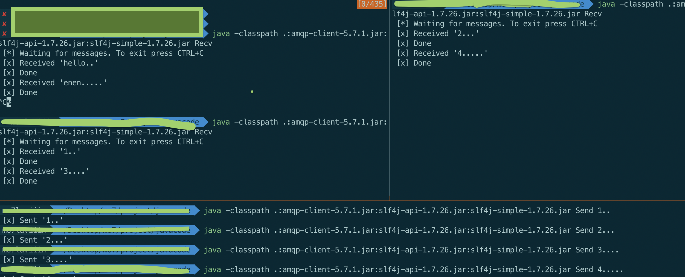

# Work Queues

> Distributing tasks among workers 

前一章节主要是RabbitMQ所实现简单的信息收发，本章将会创建一个工作队列，来在不同Worker间分发任务。

## 准备工作

利用`Thread.sleep()`来模拟具体的任务执行，发送消息的格式为`hello....`，其中以圆点来代表任务的复杂程度，即一个圆点增加一秒睡眠时间。

Send.java的代码只需做简单的修改，来允许从命令行读取输入参数：

```
String message = String.join(" ", argv);

channel.basicPublish("", "hello", null, message.getBytes());
System.out.println(" [x] Sent '" + message + "'");
```

Recv.java带代码通过修改，来模拟任务的执行：

```
DeliverCallback deliverCallback = (consumerTag, delivery) -> {
  String message = new String(delivery.getBody(), "UTF-8");

  System.out.println(" [x] Received '" + message + "'");
  try {
    doWork(message);
  } finally {
    System.out.println(" [x] Done");
  }
};
boolean autoAck = true; // acknowledgment is covered below
channel.basicConsume(TASK_QUEUE_NAME, autoAck, deliverCallback, consumerTag -> { });

private static void doWork(String task) throws InterruptedException {
    for (char ch: task.toCharArray()) {
        if (ch == '.') Thread.sleep(1000);
    }
}
```
其中`doWork`为模拟任务的执行函数。

## 轮询分发

编译代码，并执行。

运行两个Worker示例，然后多次运行`Send`端，多次发送消息，运行状态如下：



如图所示，两个Worker分别执行了1、3和2、4。

这主要是因为，RabbitMQ中当有多个Worker时，收到多个来自消费者的消息时，队列会将消息以轮询（Round-Robin）的方式，依次分发给多个Worker。

## 消息确认

任务的执行通常会耗费一段时间。而如果消费者在执行任务期间崩溃了，导致只完成了部分工作，那该如何处理？在当前的代码中，一旦RabbitMQ将一个消息分发给消费者，就立即将其标注为删除状态。这样一来，如果我们kill掉一个Worker，那么也就会丢失掉它正在处理的消息，同时也会丢失掉所有被分发到该Worker但还未被处理的所有消息。

但是，对于我们而言，我们不想丢失掉任何一个任务。如果一个Worker崩溃了，其所属的任务能够被重新分发给其他Worker。

为确保消息不丢失，`RabbitMQ`支持消息确认。消费者可以发送ack确认，来告诉RabbitMQ其已经正确接收并处理了消息，然后RabbitMQ便可删除消息。

如果一个消费者中途崩溃了，没有发送ack确认。RabbitMQ就会知道，该消息并没有被彻底处理完成，会将其重新排队。如果此时还有其他的消费者，其会快就会被递送给它们进行处理。这样一来就可以确保没有消息丢失，即便Worker中途偶然死掉了。

没有消息的超时机制。消费者崩溃，消息会被重新分发，即便消息的处理过程会耗费很长时间。

默认情况下，RabbitMQ是需要手动确认的。在之前的代码中，我们通过`autoAck=true`关闭了手动确认。现在我们将其设定为`false`，手动发送确认消息。


```
channel.basicQos(1); // accept only one unack-ed message at a time (see below)

DeliverCallback deliverCallback = (consumerTag, delivery) -> {
  String message = new String(delivery.getBody(), "UTF-8");

  System.out.println(" [x] Received '" + message + "'");
  try {
    doWork(message);
  } finally {
    System.out.println(" [x] Done");
    channel.basicAck(delivery.getEnvelope().getDeliveryTag(), false);
  }
};
boolean autoAck = false;
channel.basicConsume(TASK_QUEUE_NAME, autoAck, deliverCallback, consumerTag -> { });
```

确认消息一定要通过同一channel进行发送。如果使用不同的channel发送确认消息，会引发channel层的协议异常。

> 忘记确认
> 一个很常见的错误是忘记了`basicAck`，这是个很简单的错误但会引发很严重的后果。当你的Worker完成工作退出时，由于没有确认，消息会被重新分发，这样一来，由于始终得不到确认，消息会被不断分发然后执行任务，然后不断的增加内存消耗。
> 可以通过`rabbitmqctl list_queues name messages_ready messages_unacknowledged`查看未被确认的消息。

## 消息持久性

当`RabbitMQ`奔溃时，我们希望当前的队列和消息不会消失。为此，需要完成两项工作，即分别将队列和消息标记为可持久性。

首先，将队列标记为持久性：

```
boolean durable = true;
channel.queueDeclare("task_queue", durable, false, false, null);
```

注：`RabbitMQ`不允许对已有队列进行其参数的修改，会触发异常。

然后，将消息标记为持久性：

```
import com.rabbitmq.client.MessageProperties;

channel.basicPublish("", "task_queue",
            MessageProperties.PERSISTENT_TEXT_PLAIN,
            message.getBytes());
```

**注：这种方式并不能完全保证消息不会丢失。想要寻求更加健壮的消息持久性，可参考官网手册。**

## 公正分发

至此，其实并不能保证消息分发的公正性，可能一个Worker不断接收繁重的任务而另一个不断接收轻量级任务。

这是因为当一个消息进入队列中，`RabbitMQ`就分发该消息。它并不关心当前消费者未确认的消息数量。

为解决该问题，可进行简单的设置修改：

```
int prefetchCount = 1;
channel.basicQos(prefetchCount);
```

这样就可以保证，一个Worker同时只接收并处理一条消息。换而言之，只有当一个Worker完成一个消息的处理并完成确认，才会向其派发新的消息任务。