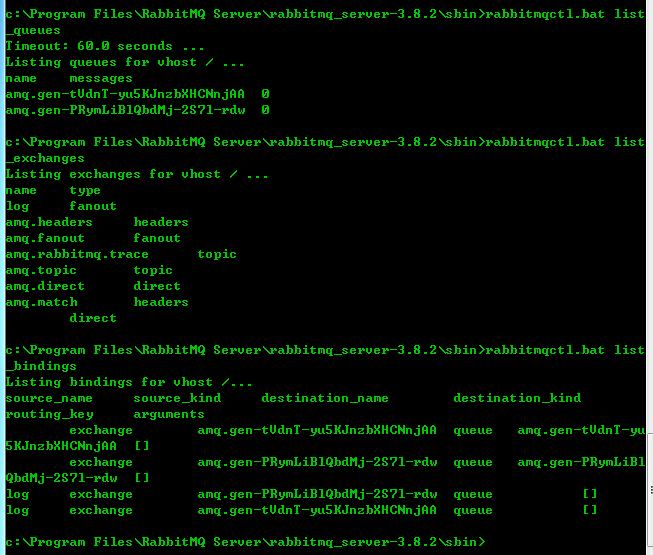
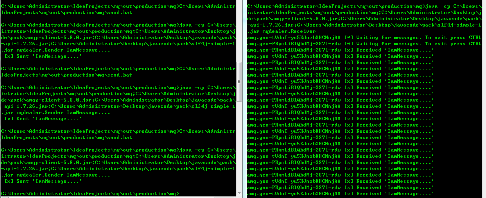

# Publish_Subscirbe

> Sending messages to many consumers at once

一个消息传递给多个消费者，这种模式称之为 **Publish/Subscribe（发布/订阅）**

创建一个日志系统，包含两个程序，一个将日志打印到屏幕，一个将日志写入硬盘。

本质上而言，发布的日志消息将会广播给所有接收者。

## Exchange 交换器

之前章节中的模型：

+ 生产者是用于发送消息的应用程序
+ 队列用于存储消息的缓冲区
+ 消费者是用于接收消息的应用程序

但是RabbitMQ消息模型的核心思想中，生产者永远不会直接将消息发送给队列。事实上，生产者甚至不知道消息是否会被投递到队列。

实际上，生产者只会把消息发送给**exchange交换器**。交换器的模型很简单，一端接收消息，另一端将消息发送给队列。交换器必须明确知道当它接收到消息时该如何处理，比如，是将消息附加到一个队列还是多个队列，还是直接丢弃。这些都取决于交换器类型。

共有4中交换器类型：`direct`, `topic`, `headers` 和 `fanout`。这里创建一个`fanout`类型的交换器，成为`logs`

```
channel.exchangeDeclare(exchange="logs", type="fanout");

exchangeDeclare方法有多个重载，但均由下面这个方法中缺省的某些参数构成：

public DeclareOk exchangeDeclare(String exchange, 
    String type, boolean durable, 
    boolean autoDelete, boolean internal, 
    Map<String, Object> arguments) throws IOException；
```


`fanout`交换器模型很简单，它将所接收到的消息广播给它所知道的所有队列。

查看当前的交换器信息：

```
rabbitmqctl list_exchanges
```

**无名交换器**：

```
channel.basicPublish("", "hello", null, message.getBytes());
```

在之前的章节中，我们并不知晓交换器，但依然能够将消息发送给队列。那是因为使用了默认交换机，即第一个参数的`""`空字符串。


## 临时队列

在之前的章节中，将队列命名为特定的hello或是task_queue。能够对队列命名是至关重要的。

但对我们的日志系统而言，这并不适用。因为我们需要监听所有的日志消息，而不是它们的子集。并且我们只对当前正在流转的消息感兴趣，而不是过时的就消息。为此，需要做两件事。

1. 无论何时，连接到rabbit，都能得到一个新的、空的队列。可让服务器为我们选择一个随机的队列名称。
2. 断开消费者连接时，队列能够自动删除。

```
String queueName = channel.queueDeclare().getQueue();

public com.rabbitmq.client.AMQP.Queue.DeclareOk queueDeclare() throws IOException {
        return this.queueDeclare("", false, true, true, (Map)null);
    }

public com.rabbitmq.client.impl.AMQImpl.Queue.DeclareOk queueDeclare(String queue, boolean durable, boolean exclusive, boolean autoDelete, Map<String, Object> arguments) throws IOException {
        validateQueueNameLength(queue);
        return (com.rabbitmq.client.impl.AMQImpl.Queue.DeclareOk)this.exnWrappingRpc((new com.rabbitmq.client.AMQP.Queue.Declare.Builder()).queue(queue).durable(durable).exclusive(exclusive).autoDelete(autoDelete).arguments(arguments).build()).getMethod();
    }

Name
Durable (the queue will survive a broker restart)
Exclusive (used by only one connection and the queue will be deleted when that connection closes)
Auto-delete (queue that has had at least one consumer is deleted when last consumer unsubscribes)
```

这样通过默认参数就得到一个非持久的、专用的、自动删除的队列。

## 绑定

至此，已经拥有一个`fanout`交换器和一个队列，我们需要告诉交换器将消息发送给队列。交换器与队列之间的这种关系就称之为**绑定**:

```
channel.queueBind(queueName, "logs", "");

public com.rabbitmq.client.impl.AMQImpl.Queue.BindOk queueBind(String queue, String exchange, 
    String routingKey, Map<String, 
    Object> arguments) throws IOException 
```

这里的`routingkey=""`，由于交换器是广播类型的，因此`routingkey`参数在此处不影响路由信息。

通过如下命令可查看当前绑定的信息：

```
rabbitmqctl list_bindings
```

## 整合

publish.java:

```
private final static String EXCHANGE_NAME = "log";

private static void publish(String message) throws Exception{
        ConnectionFactory factory = new ConnectionFactory();
        factory.setHost(HOST_NAME);
        try(Connection connection = factory.newConnection();
                Channel channel = connection.createChannel()){
            //channel.exchangeDeclare(EXCHANGE_NAME, "fanout");
            //这里在subscribe端exchangeDeclare
            channel.basicPublish(EXCHANGE_NAME, "", null, message.getBytes("UTF-8"));
            //routingkey="" 不影响消息的路由
            System.out.println(" [x] Sent '" + message + "'");
        }
    }
```

subscribe.java：

```
private static void subscribe() throws Exception{
        ConnectionFactory factory = new ConnectionFactory();
        factory.setUsername(USERNAME);
        factory.setPassword(PASSWORD);
        factory.setHost(HOST_NAME);
        Connection connection = factory.newConnection();
        Channel channel = connection.createChannel();

        channel.exchangeDeclare(EXCHANGE_NAME,"fanout");
        String queuename1 = channel.queueDeclare().getQueue();
        String queuename2 = channel.queueDeclare().getQueue();

        channel.queueBind(queuename1,EXCHANGE_NAME,"");
        channel.queueBind(queuename2,EXCHANGE_NAME,"");
        //这里的bindingkey="" 不影响路由状态

        System.out.println(queuename1 + " [*] Waiting for messages. To exit press CTRL+C");
        System.out.println(queuename2 + " [*] Waiting for messages. To exit press CTRL+C");

        DeliverCallback deliverCallback1 = (consumerTag, delivery) -> {
            String message = new String(delivery.getBody(), "UTF-8");
            System.out.println(queuename1 + " [x] Received '" + message + "'");
        };

        DeliverCallback deliverCallback2 = (consumerTag, delivery) -> {
            String message = new String(delivery.getBody(), "UTF-8");
            System.out.println(queuename2 + " [x] Received '" + message + "'");
        };

        channel.basicConsume(queuename1,true,deliverCallback1, consumerTag -> { });
        channel.basicConsume(queuename2,true,deliverCallback2, consumerTag -> { });
    }
```

执行subscribe端，可看到交换器、队列、绑定信息：



执行publish端，消息经过交换器、队列成功递送到处理程序：


