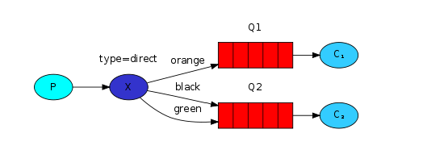
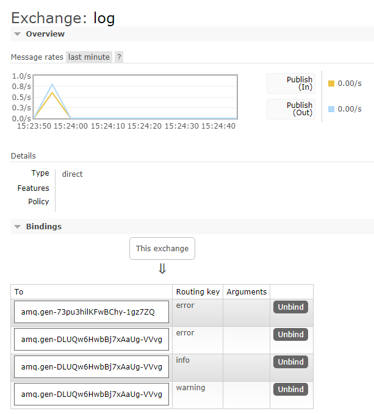
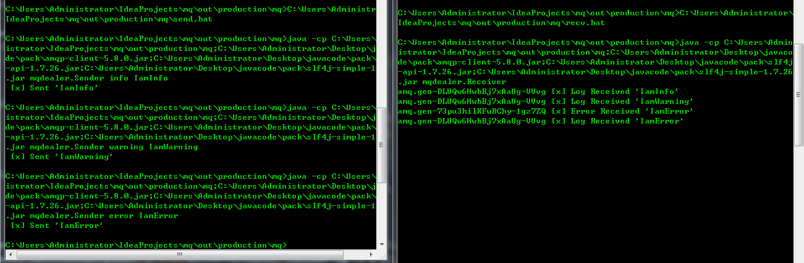

# Routing

> Receiving messages selectively

本章主要实现subscribe订阅部分消息的功能，而不是订阅全部消息。

## 绑定

之前的章节提过，绑定是交换器和队列之间的一种关系。

```
channel.queueBind(queueName, EXCHANGE_NAME, "black");
```

queueBind方法可传入`bindingkey="black"`参数，当交换器为`fanout`类型时，该参数失效。

## direct交换器

`fanout`类型交换器不够灵活，只能无意义的广播消息。

因此这里使用`direct`交换器，其路由规则很简单：当发送的消息的`routingkey`与队列绑定的`bindingkey`一致时，将消息路由到该队列中。



在上述示例模型中，当消息的`routingkey`为orange时，将会递送到Q1队列；为`black`或`green`时，送到Q2队列中。其他的所有消息将会被丢弃。

也可将同一`bindingkey`绑定到多个队列中。

## 整合

因此，将日志类型分为`info,warning,error`，交换器设定为`direct`，两个队列Q1和Q2，Q1的`bindingkey`为`error`，Q2的`bindingkey`为`info,warning,error`。这样一来，发送消息时赋予不同的`routingkey`，即可实现消息路由到两个不同的队列中，执行不同的处理程序。

send.java:

```
private static void routingSend(String[] message) throws Exception{
        ConnectionFactory factory = new ConnectionFactory();
        factory.setHost(HOST_NAME);
        try(Connection connection = factory.newConnection();Channel channel = connection.createChannel()){
            channel.basicPublish(EXCHANGE_NAME, message[0], null, message[1].getBytes("UTF-8"));
            System.out.println(" [x] Sent '" + message[1] + "'");
        }
    }
```

recv.java:

```
        ......
        channel.exchangeDeclare(EXCHANGE_NAME,"direct");
        String queue1 = channel.queueDeclare().getQueue();
        String queue2 = channel.queueDeclare().getQueue();

        channel.queueBind(queue1,EXCHANGE_NAME,"error");
        for(String severiy: new String[]{"info", "error", "warning"}){
            channel.queueBind(queue2,EXCHANGE_NAME,severiy);
        }
        ......
```

在Rabbit的WEB管理截面中可以看到交换器log的绑定信息：



实现信息的路由分发：



