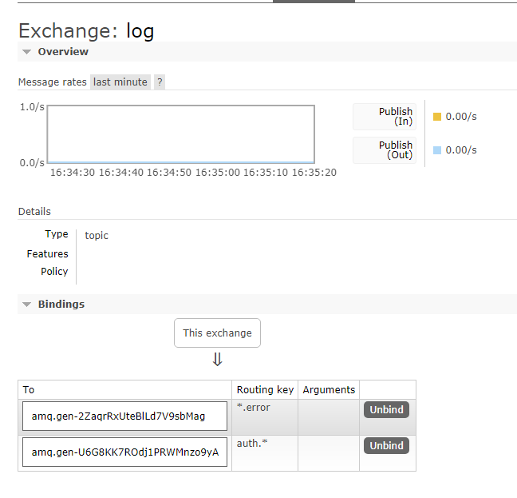
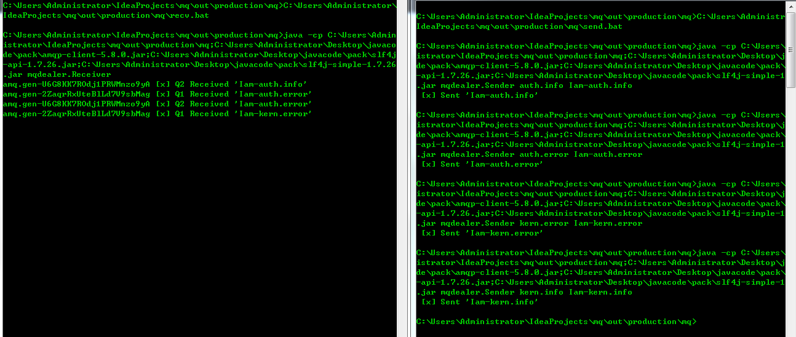

# Topics

> Receiving messages based on a pattern (topics)

## topic交换器

发送到topic交换器的消息的`routingkey`，应该是以点分割的单词列表。单词可以是任意的，但通常指明消息的某些特征，例如`"stock.usd.nyse", "nyse.vmw", "quick.orange.rabbit"`，最长为255字节。

队列与交换器的`bindingkey`也是相同的形式。topic交换器与direct交换器的逻辑上有相似之处，即具备特定`routingkey`的消息会被发送到所有与之匹配的`bindingkey`对应的队列上。

`bindingkey`有两个特殊情况：

+ `*` 代表一个单词
+ `#` 代表零个或多个单词

示例略。

+ 当`bindingkey="#"`，等同于`fanout`交换器
+ 当`bindingkey="someword"`，不使用`*`和`#`时，等同于`direct`交换器

## 整合

`routingkey`设定模式为`<facility>.<severity>`
```
facility: {"auth","cron","kern"}

severity: {"info","error","warning"}
```


recv.java:

```
        ......
        channel.exchangeDeclare(EXCHANGE_NAME,"topic");
        String queue1 = channel.queueDeclare().getQueue();
        String queue2 = channel.queueDeclare().getQueue();

        channel.queueBind(queue1,EXCHANGE_NAME,"*.error");
        channel.queueBind(queue2,EXCHANGE_NAME,"auth.*");
        ......
```

绑定信息如下：



信息路由状态如下：



可以看到`auth.info`进入Q2，`auth.error`进入Q1和Q2，`kern.error`进入Q1，`kern.info`被丢弃。
